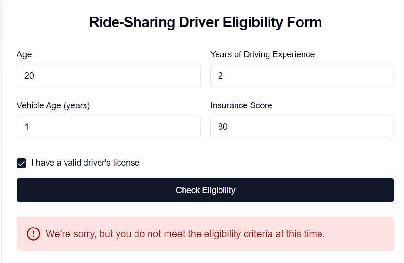

# Rule Engine with InfluxDB

A rule engine system using Abstract Syntax Tree (AST) for dynamic rule evaluation with InfluxDB.


## Environment Setup
```bash
INFLUXDB_URL=http://influxdb:8086
INFLUXDB_TOKEN=your-super-secret-auth-token
INFLUXDB_ORG=myorg
INFLUXDB_BUCKET=rules
```

## Quick Start
```bash
# Build and start services
task setup
```
```bash
# Stop and clean up
task down
```

Run frontend
```bash
cd frontend && npm run dev
```

## Rule Engine API Endpoints

### Create Rule
```bash
POST /api/rules
Content-Type: application/json

{
  "rule_string": "((age > 30 AND department = 'Sales') OR (age < 25 AND department = 'Marketing'))"
}
```

### Combine Rules
```bash
POST /api/rules/combine
Content-Type: application/json

{
  "rules": [
    "rule1_id",
    "rule2_id"
  ]
}
```

### Evaluate Rule
```bash
POST /api/rules/evaluate
Content-Type: application/json

{
  "rule_id": "combined_rule_id",
  "data": {
    "age": 35,
    "department": "Sales",
    "salary": 60000,
    "experience": 3
  }
}
```

Screenshots:


